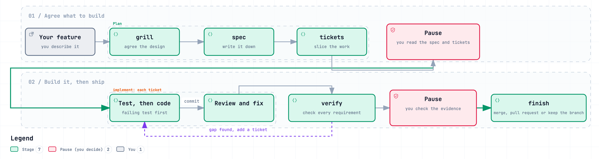
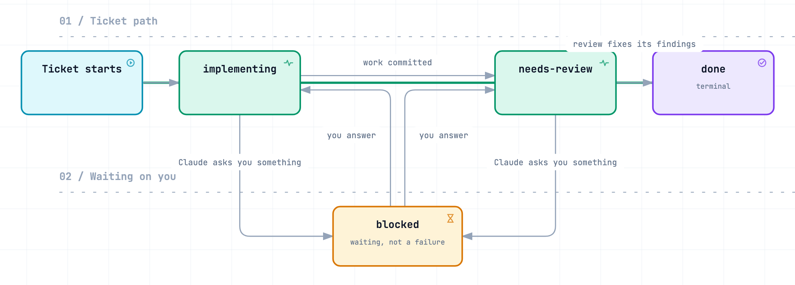
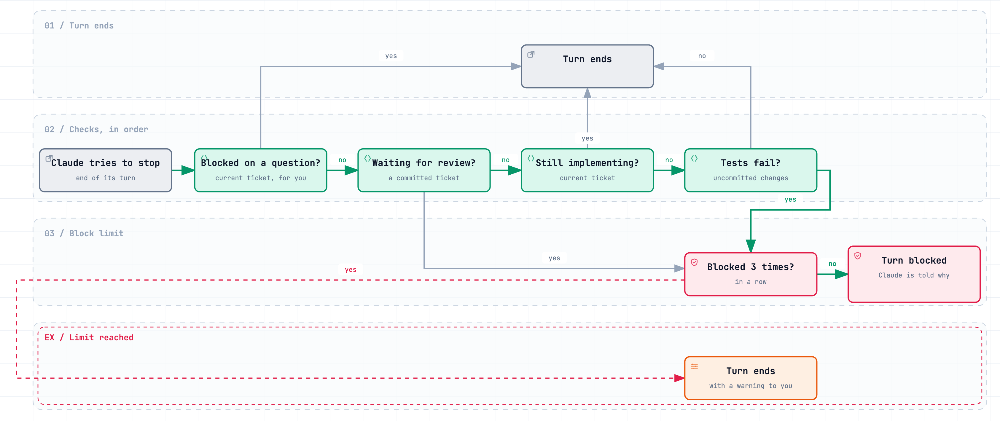
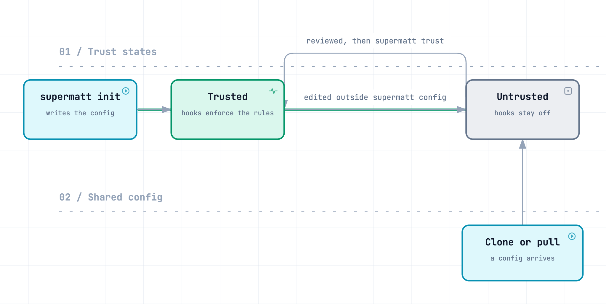
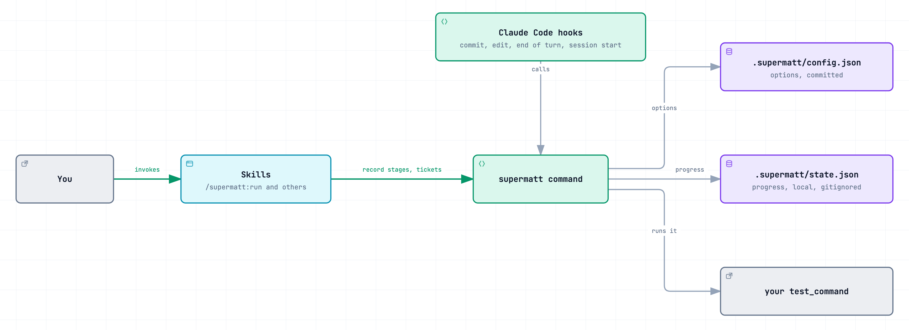

# supermatt

supermatt is a Claude Code plugin that keeps a feature moving from idea to merged code, and keeps you on track while it does. It takes the engineering skills from [Matt Pocock's skills](https://github.com/mattpocock/skills), adds a few from [obra/superpowers](https://github.com/obra/superpowers) and a few of its own, and runs them as one guided process. Claude knows which step comes next, starts it for you, and remembers where you stopped.

```text
/supermatt:run add CSV export to the reports page
```

## Why it exists

I built supermatt because I needed it. I have several traumatic brain injuries from active-duty military service during the Global War on Terror, and adult ADHD as a direct result of them. My memory fails in odd ways and I distract myself easily. I start a feature, wander into something interesting, and forget to push the real work forward.

I was using two excellent skill collections, and each solved half of my problem.

- **Superpowers guides you.** Its skills start by themselves and lead you through a process from idea to finished work, so you always know what comes next. That guidance is what keeps me on track. But in my projects it spread its own files and conventions through the repo, and when I called one of Matt Pocock's skills partway through, the session, branch or worktree often ended up in a mess.
- **Matt Pocock's skills are the ones I prefer to build with**, almost every time. But you start each one yourself and nothing connects them. I would forget to use the one I needed and regret it later. I didn't know what order they belonged in as a process. Once I had started, I couldn't tell when a step was finished or which skill came next.

I wanted the guidance of Superpowers with the skills of Matt Pocock, and nothing offered that, so I fused them. For me the result works like the bumpers in a bowling lane. When something off-course catches my attention, I note it for later and keep going, because the process is still there pointing at the next step.

You don't need a brain injury to get something from this. If you have lost an afternoon to a tangent, skipped a step you knew mattered, or come back to a project with no idea where you left off, you have the same problem in a milder form.

## What it does

- **It gives the skills an order.** `/supermatt:run` takes a feature through six stages: settle the design with you, write the spec, split it into small tickets, build each ticket test-first with a review, check the result against the spec, then merge or open a pull request. You never have to know which skill is next or when it is time to move on.
- **It starts the right skill for you.** Most skills start by themselves when your request fits, so forgetting one stops being possible. Four that should only ever run on purpose (`run`, `triage`, `wayfinder` and `handoff`) stay yours to type.
- **It remembers where you are.** Progress is recorded in your repo. After `/clear`, a context compaction or a week away, `/supermatt:run` picks the feature up at the stage where it stopped.
- **It tells you where to start.** Describe your situation to `/supermatt:advise` in your own words. It reads the repo, then lays out which skills to run, in what order, and why.
- **It is one skill set, not two fighting each other.** Of the 21 skills, most are Matt Pocock's, three from Superpowers fill the gaps (`verify`, `finish` and `worktree`), and `run`, `status`, `advise` and `drift` are my own, built for the gaps neither collection covered. Overlapping skills were merged and they all call each other by name, so using one in the middle of another no longer breaks the session.
- **It stays light.** supermatt does nothing in a repo until you set that repo up, and [the files it adds](#what-supermatt-adds-to-your-repo) are few and listed. Its checks run as hooks, not as instructions Claude keeps re-reading and re-running: a passing test run adds nothing to the conversation, files that already passed are not tested again, every rule can be set to `off`, `warn` or `block`, and the end-of-turn check gives up after three tries, so a session can't loop forever burning tokens.

**The intended outcome.** You describe a feature, or a problem, and get working, tested, reviewed code through a process you can repeat without holding it in your head. "Done" means your test command passes and every spec requirement has been checked, not that Claude says so.

| | Claude Code on its own | With supermatt |
|---|---|---|
| Design | Depends on how you prompt | Claude asks you questions until the design is settled, then writes it down |
| Tests | Depends on how you prompt | Claude writes a failing test before each piece of code |
| "Done" | Claude says so | Your test command passes, each ticket is reviewed, every spec requirement is checked |
| After `/clear` or in a new session | No record of where the feature stands | Resumes at the recorded stage |
| Your say | Whenever you interrupt | Two pauses by default: before any code is written, and before anything is merged |

**What a finished run leaves you.** The feature's commits, each made after your test command passed (with a test command set and the default preset). The spec and a set of closed tickets in your tracker; with the local tracker these are `.scratch/<feature>/spec.md` and `.scratch/<feature>/issues/01-<slug>.md` onwards. Any new glossary terms in `CONTEXT.md` and decisions in `docs/adr/`. A verify report, shown at the second pause, that lists each spec requirement with the evidence that it is met. The commits end up merged into the branch you started from, in a pull request, or kept on their own branch, whichever you choose.

The evidence is only as strong as your test command (see [Limits](#limits)). For a small fix you don't need the whole pipeline: call one skill such as `/supermatt:debug` or `/supermatt:implement`, or ask `/supermatt:advise` where to start.

**Contents:** [Why it exists](#why-it-exists) · [What it does](#what-it-does) · [How it works](#how-it-works) · [Install](#install) · [Quick start](#quick-start) · [The advisor](#not-sure-where-to-start-ask-the-advisor) · [Skills](#skills) · [Options and guardrails](#options-and-guardrails) · [Trust, safety and limits](#trust-safety-and-limits) · [Troubleshooting](#troubleshooting) · [The supermatt command](#the-supermatt-command) · [Develop](#develop) · [Credits and licence](#credits-and-licence)

## How it works

`/supermatt:run` takes a feature through six stages, each run by the skill of the same name, and the implement stage also calls `/supermatt:review` after each ticket.



*The pipeline `/supermatt:run` drives. The hexagons are the two default pauses, where Claude summarises the last stage and waits for your go-ahead. Both pauses are [options](#pipeline-and-other-options).*

| Stage | What happens |
|---|---|
| **grill** | Claude questions you in rounds ("grilling"). Each round is a numbered set of questions, each with a recommended answer, and rounds continue until the design is settled. New terms go into `CONTEXT.md` (the project glossary) and hard-to-reverse decisions into `docs/adr/` as ADRs (short architecture decision records). |
| **spec** | The conversation becomes a written spec in your issue tracker. It names the seams under test (the public interfaces the tests will drive, never internals) and any decisions that were assumed rather than asked. |
| **tickets** | The spec is split into tracer-bullet tickets: thin slices that each work end to end through every layer, so each one can be checked on its own. Each ticket lists the tickets that must finish before it. |
| **implement** | One ticket at a time, Claude writes a failing test, writes just enough code to pass it, repeats until the ticket is covered, and commits. It then reviews the change twice, once per axis. One pass checks your coding standards (files such as `CONTRIBUTING.md` or `CODING_STANDARDS.md`, plus a built-in list of common code smells that applies even if you have none), the other checks the ticket's requirements. Claude then fixes what they find. With `pipeline.review_agents` on, the two passes run as parallel sub-agents, each with a fresh context. |
| **verify** | Every requirement in the spec is checked against current evidence: a command run on the files as they stand, its output read. Each gap becomes a new ticket and goes back through implement, once: gaps left after that round come to you. |
| **finish** | The full test suite runs (unless these exact files already passed it), then the work is merged into the branch it started from, opened as a pull request, or kept on its branch. |

The reviewers are still Claude, so treat the review as a second reading, not an independent audit. The hard evidence is your test command passing and the requirement-by-requirement check against the spec, which you see at the second pause.

`run` records each stage as it starts it. After `/clear`, automatic context compaction or a new session, `/supermatt:run` resumes at that stage. Anything already written down (the spec, the tickets, commits, `CONTEXT.md`, ADRs) carries over. A conversation still in progress inside a stage, such as unfinished grilling, does not, so finish the planning stages in one sitting when you can.

## Install

You need Claude Code with the `claude plugin` command (check with `claude plugin --help`), `python3` 3.9 or newer on `PATH` (standard library only), `git`, and macOS or Linux. If your issues live on GitHub or GitLab, you also need the `gh` or `glab` CLI, signed in. Your repo should have a test command: without one, the two test guardrails do nothing and verify has less evidence to work from.

```bash
claude plugin marketplace add deathxdefeat/supermatt
claude plugin install supermatt@supermatt
```

Restart Claude Code, or run `/reload-plugins`, and check that `claude plugin list` shows `supermatt@supermatt` as enabled. Its hooks do nothing in a repo until you set that repo up, so it is safe to leave enabled everywhere.

To uninstall, run `claude plugin uninstall supermatt@supermatt`. Repos you set up keep their `.supermatt/` folder; with the plugin gone, nothing reads it. To work on supermatt itself, see [Develop](#develop).

## Quick start

Open Claude Code in a git repo and start a feature:

```text
/supermatt:run add CSV export to the reports page
```

1. **Setup, first time only.** The first run in a repo starts `/supermatt:setup`. It looks around the repo, then asks five things, one at a time, each with a recommended answer you can accept in a word:
   - where issues live: GitHub, GitLab, local markdown files, or something else you describe
   - whether to keep the default triage labels (the labels used to sort incoming issues)
   - which test command to run (it runs the candidate once to check it works)
   - how strict the guardrails should be (a [preset](#presets))
   - how the pipeline should behave: when to pause, whether to branch, how to finish

   It shows you drafts of everything it will write before writing it.
2. **Repo already set up by a teammate?** Setup is skipped. `/supermatt:run` shows you the committed config's `test_command` and asks you to approve it on this machine, because the hooks will run that command. Until you approve it, each session starts with "supermatt is off in this repo". See [Trust](#trust-safety-and-limits).
3. **The pipeline runs** through the stages in [How it works](#how-it-works). At the first pause, read the spec and tickets. At the second, check the verify evidence, then choose merge, pull request or keep the branch.

Come back any time: `/supermatt:run` with no arguments resumes the feature at its recorded stage, and each new session (and each `/clear` or compaction) tells Claude which feature is in flight.

Flags change a single run:

| Flag | Effect |
|---|---|
| (no flag) | Uses this repo's options. By default, Claude waits for your answers during grilling and pauses before `implement` and `finish`. |
| `--auto` | Claude answers its own grilling questions with the recommended answers, lists them as assumptions in the spec, and does not pause. It still stops for the finish menu, unless the repo is set to always merge, always open a PR or always keep the branch (`pipeline.finish`). |
| `--guided` | Claude waits for your answers during grilling and pauses before every stage. |
| `--from spec\|tickets\|implement\|verify` | Starts a new feature at a later stage when the earlier work already exists (a settled design, a spec, tickets or built code), so the pipeline still tracks it without grilling you again. |

### What supermatt adds to your repo

| Path | Commit it? | What it holds |
|---|---|---|
| `.supermatt/config.json` | Yes, before any worktree is created, so worktrees see it | This repo's options: test command, guardrail levels, pipeline behaviour. Each teammate approves it on their own machine, and again after any change they pull, before its hooks run (see [Trust](#trust-safety-and-limits)). |
| `.supermatt/state.json` | No, setup gitignores it | The pipeline's progress on this machine |
| `docs/agents/issue-tracker.md`, `triage-labels.md`, `domain.md` | Yes | Where issues live, the label names, and where the domain docs live. Edit them freely. |
| An `## Agent skills` section in `CLAUDE.md` or `AGENTS.md` | Yes | Points agents at the three files above. Setup edits whichever file exists, and asks if neither does. |
| `CONTEXT.md`, `docs/adr/` | Yes | Glossary terms and design decisions, kept up to date during grilling |
| `.scratch/<feature>/` | Your choice | Only with the local markdown tracker: `spec.md` and one `issues/NN-<slug>.md` per ticket |

## Not sure where to start? Ask the advisor

Describe your situation in your own words:

```text
/supermatt:advise the export has been "fixed" three times and still writes an empty file
```

`/supermatt:advise` reads what you wrote, then checks the repo itself: the pipeline status, recent commits, open specs and tickets, `CONTEXT.md` and ADRs, and the tests (it runs them once if that is cheap). It makes no edits, commits or stage changes. Its answer has four parts:

1. **What this is**: the kind of situation, with the evidence, including anything the repo showed that you did not mention.
2. **The plan**: numbered steps, each with the exact command, why it comes at that point, and what finished looks like.
3. **What to watch for**: the one or two ways the plan is most likely to go wrong.
4. **Start here**: the first command to type.

Tell it to go and it starts step 1 itself. The exceptions are the four skills only you can start (`run`, `triage`, `wayfinder` and `handoff`): for those, it tells you what to type.

| Situation | Starts with |
|---|---|
| A feature you can describe in a few sentences | `/supermatt:run <feature>` |
| An idea where you can't yet say what done looks like | `/supermatt:grill`, then `/supermatt:run` |
| A plan, spec or tickets that already exist from outside the pipeline | `/supermatt:run <feature> --from <stage>` |
| Work too big for one session | `/supermatt:wayfinder` |
| Something that should work but doesn't | `/supermatt:debug` |
| Work that keeps being called done but still doesn't work | An end-to-end acceptance test first, then diagnosis |
| A design that fights every change | `/supermatt:architecture` |
| A question only running code can settle | `/supermatt:prototype` |
| Facts you need from docs or APIs | `/supermatt:research` |
| A pile of incoming issues | `/supermatt:triage` |
| Work that may have grown past what you approved | `/supermatt:drift` |
| A feature already in flight | `/supermatt:run` to resume |

If the "keeps being called done" row applies together with another one, the advisor deals with it first. It means nothing checks the outcome you actually care about, so every step can pass its own checks and still ship something broken. The plan starts by writing that outcome as one end-to-end acceptance test (a real input and the exact expected output) and adding it to your test command. Under the `standard` preset, Claude then can't commit while that test fails.

## Skills

All 21 skills are invoked as `/supermatt:<name>`. Where skills from the two source collections (Matt Pocock's and obra/superpowers) overlapped, they were merged into one, and the skills call each other by these names. Claude also starts a skill by itself when your request fits, except the four marked *(you type it)*.

**Driving the workflow**

| Skill | What it does |
|---|---|
| `/supermatt:run` *(you type it)* | Takes a feature through every stage and resumes where it stopped |
| `/supermatt:advise` | Reads your situation and the repo, then lays out which skills to run, in what order, and why |
| `/supermatt:setup` | Sets a repo up once: issue tracker, labels, domain docs, test command, options. `run` starts it for you when a repo isn't set up. |
| `/supermatt:status` | Shows the pipeline's progress, the options, and whether this machine has approved the config ([trust](#trust-safety-and-limits)). Changes options when you ask. |

**Pipeline stages** (`run` calls these; each also works on its own)

| Skill | What it does |
|---|---|
| `/supermatt:grill` | Questions you in rounds until the design is clear, writing `CONTEXT.md` terms and ADRs as they are decided |
| `/supermatt:spec` | Turns the conversation into a spec in your issue tracker, without a new interview |
| `/supermatt:tickets` | Splits a spec into tracer-bullet tickets, each listing what blocks it |
| `/supermatt:implement` | Builds a ticket, a spec or a described behaviour test-first, commits it, and hands it to review |
| `/supermatt:review` | Reviews against your coding standards and against the spec, in parallel, then fixes the findings and closes the ticket |
| `/supermatt:verify` | Requires evidence from the current files before anything is called done |
| `/supermatt:finish` | Runs the full test suite, then merges, opens a pull request, or keeps the branch |

**On demand**

| Skill | What it does |
|---|---|
| `/supermatt:debug` | Diagnoses hard bugs and slowdowns: first a command that reproduces the failure, then a fix with a regression test |
| `/supermatt:merge` | Resolves a stopped merge, rebase or cherry-pick by what each side meant to do |
| `/supermatt:triage` *(you type it)* | Sorts incoming issues and writes briefs an agent can work from |
| `/supermatt:prototype` | Builds throwaway code to settle one design question |
| `/supermatt:research` | Sends a background agent to primary sources and saves a cited Markdown file |
| `/supermatt:architecture` | Helps design modules, and finds places where a module should do more behind a smaller interface |
| `/supermatt:wayfinder` *(you type it)* | Breaks a large, unclear effort into decision tickets and resolves them one at a time |
| `/supermatt:drift` | Checks a spec, tickets, plan or work in progress against what you actually approved, lists each departure as *against* or *beyond* what you approved, and changes nothing until you rule |
| `/supermatt:worktree` | Sets up an isolated workspace, such as a separate git worktree, for feature work |
| `/supermatt:handoff` *(you type it)* | Writes a handoff document so a fresh session can pick up the work |

## Options and guardrails

Guardrails are four rules, enforced by Claude Code hooks and the `supermatt` command, that can stop Claude committing with failing tests (`tests_before_commit`), editing code with no ticket open (`ticket_before_code`), moving on before a finished ticket is reviewed (`review_after_ticket`), or ending its turn with failing changes (`green_before_stop`). Each rule is `off`, `warn` (the action goes ahead with a warning) or `block` (the action is stopped and Claude is told why). A preset sets all four at once.

Each repo keeps its options in `.supermatt/config.json`, which you commit so the whole team shares them. To change one, ask `/supermatt:status` in plain words ("turn ticket_before_code off", "use the strict preset", "pause before every stage"), or have Claude run [`supermatt config`](#the-supermatt-command).

### Ticket states

The guardrails work from each ticket's state, which the skills record as they go.



*The state supermatt records for each ticket. `blocked` means Claude is waiting on you; once you answer, the ticket returns to whichever state it came from.*

A ticket's id is its local file number (`01`) or its issue number on a hosted tracker (`123`).

### The four rules

| Rule | Checked when | What it enforces |
|---|---|---|
| `tests_before_commit` | Claude runs `git commit` through its Bash tool | The test command runs first, unless these exact files already passed it. If it fails, the commit is stopped (at `warn`, it goes ahead with a warning), and Claude sees the last 30 lines of output. A pass shows nothing. Does nothing without a `test_command`. |
| `ticket_before_code` | Claude edits a file with Edit, Write, MultiEdit or NotebookEdit | The current ticket must be `implementing` or `needs-review`. Files outside the repo, and paths matching `exempt`, are ignored. |
| `review_after_ticket` | A ticket is started or marked done, and when Claude tries to end its turn | While a committed ticket waits in `needs-review`, no other ticket can start and the turn cannot end. A ticket still `implementing` or `blocked` cannot be marked `done`: it goes through review first. A `blocked` current ticket lets the turn end. |
| `green_before_stop` | Claude tries to end its turn | Uncommitted changes to non-exempt files must pass the tests. Skipped while the current ticket is `implementing` (failing tests are a normal step in test-first work) or `blocked`, and when those changes already passed. It never blocks twice on the same unchanged files. Does nothing without a `test_command`. |

### Presets

| Preset | tests_before_commit | ticket_before_code | review_after_ticket | green_before_stop |
|---|---|---|---|---|
| `strict` | block | block | block | block |
| `standard` (default) | block | warn | block | block |
| `light` | warn | warn | warn | warn |
| `solo` | block | off | warn | off |
| `off` | off | off | off | off |

`standard` suits most repos. Choose `solo` when you work alone and want speed: tests still gate every commit, but nothing runs per edit or at the end of a turn. Choose `strict` when every code edit, including debugging and prototypes, should need a ticket first. If your test command is slow (a build plus an end-to-end suite, say), consider turning `green_before_stop` off: it runs the tests at the end of every turn that changed code, even at `warn`, and `tests_before_commit` at `block` remains the gate that matters.

### The end-of-turn check

This is the check that stops Claude from ending a turn with work unfinished.



*Shown with `review_after_ticket` and `green_before_stop` at `block`. At `warn`, the turn ends with a warning to you instead of being blocked. Not shown: when the tests fail on exactly the files that failed at the last end of turn, the turn ends with a warning instead of a second block.*

Once a set of files passes, nothing reruns the tests until the code changes again: not this check, not the commit rule, not `verify` or `finish`. The pipeline runs the suite through `supermatt test`, which shares that memory; `supermatt test --force` reruns regardless. If the same unchanged files fail twice in a row, the second end of turn warns you instead of blocking again.

### Pipeline and other options

| Option | Default | Meaning |
|---|---|---|
| `test_command` | none | The command the guardrails and the verify stage run. Without one, the two test rules do nothing. |
| `test_timeout` | `300` | Seconds before a test run counts as failed. At most 570, because Claude Code stops the commit and end-of-turn hooks after 600. |
| `exempt` | `.scratch/*`, `docs/*`, `.supermatt/*`, `*.md` | Paths the code rules ignore |
| `pipeline.interview` | `full` | `full` waits for your answers during grilling. `auto` answers each question with the recommended answer and lists these as assumptions in the spec. |
| `pipeline.pause_at` | `implement,finish` | The stages `run` pauses *before*, waiting for your go-ahead: any of `grill`, `spec`, `tickets`, `implement`, `verify`, `finish`. `none` never pauses. |
| `pipeline.branch` | `true` | Create a branch named after the feature before implementing |
| `pipeline.branch_prefix` | empty | Prefix for that branch's name, for example `claude/` when your repo names branches that way |
| `pipeline.worktree` | `false` | Implement in an isolated worktree instead, through `/supermatt:worktree` |
| `pipeline.ticket_agents` | `false` | Build each ticket in a fresh subagent. The pipeline then checks `supermatt status` and `git log` itself before the next ticket, because a subagent's report is not evidence. That subagent runs both reviews itself, one after the other. |
| `pipeline.review_agents` | `false` | Run each review's two axes as parallel subagents instead of in the main context. Costs about three reads of the diff instead of one; worth it on large diffs. |
| `pipeline.finish` | `ask` | `ask` shows a menu. `merge`, `push` (merge, test, then push the base branch), `pr` or `keep` always does that one. |

The equivalent commands:

```bash
supermatt config                                   # show every option
supermatt config preset strict                     # set all four rules
supermatt config enforce.ticket_before_code off    # set one rule
supermatt config pipeline.pause_at spec,implement,finish
supermatt config pipeline.pause_at none            # never pause
supermatt config test_command "npm test"
```

## Trust, safety and limits

The config names a command that the hooks run on their own, so supermatt acts on a repo's config only after this machine has approved it. Without that check, cloning a repo could make Claude Code run any command the repo's author chose, the next time Claude commits or ends a turn.



*Trust records the repo's path and a SHA-256 hash of the config's exact contents, so any change made outside `supermatt config` has to be approved again.*

- **Trust is exact.** `supermatt init` trusts the config it writes, and `supermatt config` keeps a trusted config trusted after its own edit. Any other change (a pull, a teammate's edit, your own hand edit) needs approving again. `/supermatt:run`, `/supermatt:setup` and `/supermatt:status` show you the `test_command` and ask before trusting.
- **You are told when supermatt is off.** An untrusted or invalid config turns the hooks off for that repo, and each session start (including after `/clear` or compaction) tells you which it is. Only the hooks go quiet: with a valid but untrusted config, the `supermatt ticket` command still applies `review_after_ticket`, because the skills call it directly.
- **Trust covers the command, not the code it runs.** Approval pins the exact `test_command` text. If that command runs code from the repo (`npm test` runs your test files), pulling or checking out code you haven't reviewed, such as an outside pull request, means the hooks will run that code the next time Claude commits or ends a turn. Review untrusted branches before working on them with the guardrails on, or set `enforce` to `off` for that checkout.
- **Where trust lives.** Trusted configs are listed in `~/.config/supermatt/trusted.json`, or at `$SUPERMATT_TRUST_FILE` if set. Linked worktrees share the main checkout's trust and pipeline state.

### What the hooks run

| Hook | Fires on | Runs | Claude Code timeout |
|---|---|---|---|
| PreToolUse | Bash tool calls | Your `test_command`, only when the command contains `git commit` and these files have not already passed it. Every other Bash call returns before touching git or the disk. | 600 s |
| PreToolUse | Edit, Write, MultiEdit, NotebookEdit | Only `git` lookups and a read of the config and pipeline state | 10 s |
| Stop | Every end of turn | `git status`, and your `test_command` when uncommitted code changed since the last passing test run. Files that failed last time and have not changed since are not run again. | 600 s |
| SessionStart | Session start, resume, `/clear` and compaction | Only `git` lookups; tells Claude which feature is in flight, or tells you why supermatt is off | 10 s |

Apart from your `test_command`, which runs through the shell in the repo root and is stopped after `test_timeout` seconds, the hooks run only read-only `git` commands, and the only file they write is `.supermatt/state.json`.

### Limits

- **Guardrails, not a sandbox.** `ticket_before_code` watches Claude's file-editing tools, not every shell command that could write a file.
- **Commits are recognised by pattern.** `tests_before_commit` looks for `git commit` in a Bash command, including forms like `git -C path commit`. A commit made through a git alias or a script is not seen, and commits you make in your own terminal are never touched.
- **Tests run on the working tree**, not only the staged changes.
- **The end-of-turn check gives up.** After three blocks in a row it lets the turn end with a warning, and it never blocks twice on the same unchanged files, so a session cannot get stuck. A stubborn failure gets through with that warning.
- **A remembered pass is about files, not the world.** supermatt skips the suite when the same non-exempt files already passed. It cannot see a database, a service or an environment variable changing underneath them. `supermatt test --force` reruns the suite when you suspect that, or a flaky test.
- **The rules are only as good as the test command.** A suite that doesn't cover the outcome you care about stays green while the product is broken. That is why `/supermatt:advise` starts such cases with an acceptance test.
- **Relaxing a rule is policy, not a lock.** The skills tell Claude never to change an option to get past a block. Claude could still run `supermatt config` itself; because the config is committed, such a change shows up in `git status`.
- **The hooks never break a session.** Bad hook input, a broken config or a bug inside supermatt never fail a tool call: a bug is reported as a message, a broken or untrusted config is reported when a session starts, and otherwise the hook quietly does nothing.

## Troubleshooting

| Symptom | Cause and fix |
|---|---|
| Nothing happens in a repo | Run `/supermatt:status`. The repo may not be set up, or its config may not be trusted on this machine. |
| A session starts with "supermatt is off in this repo" | The config is untrusted or invalid, and the message says which. If untrusted, review the file, especially `test_command`, then ask Claude to run `supermatt trust`, or say yes when `/supermatt:status` offers to trust it. If invalid, `supermatt config` won't load it: fix the named option in `.supermatt/config.json` by hand, then have Claude run `supermatt trust`, because a hand edit needs approving again. |
| supermatt switched off after `supermatt config test_timeout` | Known bug: the command accepts any number, but the hooks treat a value outside 1-570 as invalid. Set `test_timeout` to 570 or less in `.supermatt/config.json` by hand, then have Claude run `supermatt trust`. |
| "no ticket is in progress" | `ticket_before_code` caught an edit made outside a ticket. Start the work through `/supermatt:run` or `/supermatt:implement`, or add the path to `exempt` if it isn't code. |
| A commit or the end of a turn is blocked | The message says what failed and, for test failures, shows the last 30 lines of output. Fix the cause, or change the rule with `/supermatt:status`. |
| "stopped blocking after 3 attempts" | The end-of-turn checks still fail and have let the turn end. The warning lists what still needs fixing. |
| "uncommitted changes still fail the tests (no file has changed since the last failing run)" | The end-of-turn check already blocked once on these exact files and will not loop on them. The tests still fail; the commit rule still stops a commit. |
| The tests did not run on a commit, or `supermatt test` says "not rerun" | These exact files already passed. `supermatt test --force` reruns them. |
| Every turn ends with a slow test run | `green_before_stop` runs the tests at the end of each turn that changed code. Turn it off and rely on `tests_before_commit`. |
| Test runs time out | A run longer than `test_timeout` counts as a failure. Raise it (at most 570 seconds) or point `test_command` at a faster set of tests that still covers what matters. |
| The same skill appears twice | You also have the original source skills installed, for example `/tdd` next to `/supermatt:implement`. Remove one set so Claude doesn't choose between duplicates. |

## The `supermatt` command

The skills and hooks work through `plugin/bin/supermatt`, a single standard-library Python script that reads your options, records progress and runs your tests.



When the plugin is enabled, it is on the `PATH` of Claude's Bash tool, so Claude can run any of these commands when you ask. It is not on your own terminal's `PATH`. To run it there, call `python3 <plugin dir>/bin/supermatt <command>` from inside a repo, where `<plugin dir>` is `~/.claude/plugins/cache/supermatt/supermatt/<version>` for a marketplace install, or `<clone>/plugin` for a local clone or link. If unsure, ask Claude to run `command -v supermatt` for the full path. It acts on the git repo that contains the current directory.

| Command | What it does |
|---|---|
| `init [--preset P] [--test-command CMD] [--force]` | Sets the repo up: writes and trusts `.supermatt/config.json`, and gitignores the state file. The preset defaults to `standard`. Won't replace an existing config without `--force`. |
| `status [--json]` | Shows the pipeline's progress, the options, and whether the config is trusted |
| `config` | Prints every option |
| `config KEY [VALUE]` | Shows or sets one option by dotted key, for example `enforce.green_before_stop block`. `pipeline.pause_at` and `exempt` take comma-separated lists, and `pipeline.pause_at none` clears the pauses. |
| `config preset P` | Sets all four rules from a preset |
| `trust` | Approves this repo's current config on this machine |
| `start SLUG [--stage STAGE]` | Starts a feature at `grill`, or at a later stage when the earlier work already exists |
| `stage STAGE` | Records the stage: `grill`, `spec`, `tickets`, `implement`, `verify`, `finish` or `done` |
| `base BRANCH` | Records the branch the feature started from, which finish merges back into |
| `test [--force]` | Runs the test command, unless these exact files already passed it |
| `ticket ID implementing\|blocked\|needs-review\|done` | Records a ticket's state, applying `review_after_ticket` |
| `hook pre-tool\|stop\|session-start` | The entry point `plugin/hooks/hooks.json` calls, with the hook event as JSON on stdin |

## Develop

To work on supermatt itself, install from a local clone:

```bash
git clone https://github.com/deathxdefeat/supermatt.git
claude plugin marketplace add /path/to/supermatt
claude plugin install supermatt@supermatt
```

Or link the plugin folder into your skills directory. Claude Code then loads it in place as `supermatt@skills-dir`, and your edits apply in the next session (or after `/reload-plugins`):

```bash
ln -s /path/to/supermatt/plugin ~/.claude/skills/supermatt
```

Run the tests and validate the manifests from the repo root:

```bash
python3 -m unittest
claude plugin validate . && claude plugin validate plugin
```

The tests drive `plugin/bin/supermatt` the way the hooks call it, in temporary git repos. They also check that the skills' names, links and cross-references stay consistent, and that this README lists every skill. CI runs them on Ubuntu and macOS with Python 3.9 and 3.13.

| Path | What it is |
|---|---|
| `plugin/.claude-plugin/plugin.json` | The plugin manifest |
| `.claude-plugin/marketplace.json` | The marketplace entry that makes `supermatt@supermatt` installable |
| `plugin/skills/<name>/` | The 21 skills. `run`, `status` and `drift` are original; the rest are adapted from the source skills. |
| `plugin/bin/supermatt` | The command that holds options, pipeline state and the hook logic |
| `plugin/hooks/hooks.json` | The PreToolUse, Stop and SessionStart hooks, all calling `supermatt hook` |
| `tests/` | The unit tests |
| `CONTEXT.md`, `docs/adr/` | Project terms and design decisions |

### Diagrams

The diagram sources are the JSON specs in `docs/diagrams/`. The images in `docs/images/` are light-theme captures of them.

## Credits and licence

MIT; see `LICENSE`. Most skills are adapted from Matt Pocock's [skills](https://github.com/mattpocock/skills) and Jesse Vincent's [superpowers](https://github.com/obra/superpowers), both MIT. `run`, `status`, `drift`, the `advise` process, `bin/supermatt` and the hooks are original to supermatt. `plugin/NOTICE.md` has their licences and the commits the skills were imported from. supermatt is an independent project, not affiliated with or endorsed by Matt Pocock or Jesse Vincent. The adapted skills don't follow the source repositories automatically: pulling in their changes is a manual merge.
