# supermatt

[](https://github.com/deathxdefeat/supermatt/actions/workflows/test.yml)
[](CHANGELOG.md)
[](LICENSE)

supermatt is a Claude Code plugin that keeps a feature moving from idea to merged code, and keeps you on track while it does. It takes the engineering skills from [Matt Pocock's skills](https://github.com/mattpocock/skills), adds a few from [obra/superpowers](https://github.com/obra/superpowers) and a few of its own, and runs them as one guided process. Claude knows which step comes next, starts it for you, and remembers where you stopped.

I built supermatt because I needed it: several traumatic brain injuries from active-duty military service during the Global War on Terror left me with adult ADHD and a memory that fails in odd ways. It works like the bumpers in a bowling lane, so when a tangent catches my attention the process is still there pointing at the next step, and if you have ever lost an afternoon to one, it will do the same for you.

<p align="center">
  <b><a href="#install">Install</a></b> ·
  <b><a href="#quick-start">Quick start</a></b> ·
  <b><a href="#what-it-does">What it does</a></b> ·
  <b><a href="#how-it-works">How it works</a></b> ·
  <b><a href="#the-advisor">Advisor</a></b> ·
  <b><a href="#skills">Skills</a></b> ·
  <b><a href="#guardrails">Guardrails</a></b> ·
  <b><a href="#security">Security</a></b> ·
  <b><a href="#troubleshooting">Troubleshooting</a></b> ·
  <b><a href="#docs">Docs</a></b>
</p>


*The pipeline `/supermatt:run` drives. At each red Pause box, Claude summarises the last stage and waits for your go-ahead.*

## Install

You need:

- Claude Code with the `claude plugin` command
- `python3` 3.9 or newer, and `git`
- macOS or Linux. Windows is untested.
- The `gh` or `glab` CLI, signed in, if your issues live on GitHub or GitLab
- A test command for your repo. Without one, supermatt has little evidence to work from.

```bash
claude plugin marketplace add deathxdefeat/supermatt
claude plugin install supermatt@supermatt
```

Restart Claude Code or run `/reload-plugins`. supermatt does nothing in a repo until you set that repo up, so it is safe to leave enabled everywhere. To remove it, run `claude plugin uninstall supermatt@supermatt`.

<p align="right"><a href="#supermatt">↑ top</a></p>

## Quick start

Open Claude Code in a git repo and describe a feature:

```text
/supermatt:run add CSV export to the reports page
```

1. **The first run sets the repo up.** `/supermatt:setup` asks five short questions (issue tracker, labels, test command, guardrail strictness, pipeline behaviour), each with a recommended answer, and shows you what it will write first.
2. **The pipeline runs.** At the first pause, read the spec and tickets. At the second, check the evidence, then choose merge, pull request or keep the branch.
3. **Come back any time.** `/supermatt:run` with no arguments resumes the feature where it stopped, even after `/clear` or a week away.

> **Joining a repo a teammate set up?** `/supermatt:run` shows you the repo's `test_command` and asks you to approve it on your machine first, because the hooks will run it. See [Security](#security).

Add `--auto` to let Claude answer its own design questions and skip the pauses, `--guided` to pause before every stage, or `--from <stage>` to start where your existing spec or tickets leave off. For a small fix, skip the pipeline: call `/supermatt:debug` or `/supermatt:implement`, or ask [the advisor](#the-advisor).

[The pipeline](docs/pipeline.md) covers setup, flags, what a finished run leaves you, and every file supermatt adds to your repo.

<p align="right"><a href="#supermatt">↑ top</a></p>

## What it does

You describe a feature or a problem, and get working, tested, reviewed code through a process you don't have to hold in your head.

| | Claude Code on its own | With supermatt |
|---|---|---|
| Design | Depends on how you prompt | Claude questions you until the design is settled, then writes it down |
| Tests | Depends on how you prompt | A failing test comes before each piece of code |
| "Done" | Claude says so | Your tests pass, each ticket is reviewed, every spec requirement is checked |
| A new session | No record of where the feature stands | Resumes at the recorded stage |
| Your say | Whenever you interrupt | Two pauses by default: before any code, and before any merge |

- **One order.** Six stages, always in the same sequence, so you never have to know which skill is next.
- **Skills that start themselves.** Most start when your request fits. Four stay yours to type: `run`, `triage`, `wayfinder` and `handoff`.
- **One skill set.** Matt Pocock's skills, three from Superpowers and four of supermatt's own, merged so they call each other by name and stop fighting over your repo.
- **Light.** Checks run as hooks, a passing test adds nothing to the conversation, and every rule can be `off`, `warn` or `block`.

<p align="right"><a href="#supermatt">↑ top</a></p>

## How it works

| Stage | What happens |
|---|---|
| **grill** | Claude questions you in rounds, each question with a recommended answer, until the design is settled. Terms go into `CONTEXT.md`, hard-to-reverse decisions into `docs/adr/`. |
| **spec** | The conversation becomes a written spec in your issue tracker. |
| **tickets** | The spec is split into thin slices that each work end to end, so each can be checked on its own. |
| **implement** | One ticket at a time: failing test, just enough code to pass, commit, then a review against your coding standards and the ticket. |
| **verify** | Every spec requirement is checked against a command run now. Gaps become tickets, once; anything left comes to you. |
| **finish** | The full suite runs, then the work is merged, opened as a pull request, or kept on its branch. |

The reviewer is still Claude, so treat review as a second reading. The hard evidence is your test command passing and the requirement-by-requirement check you see at the second pause, and both are only as strong as [your tests](docs/security.md#limits).

Progress is recorded as each stage starts. Everything written down carries over to a new session; a half-finished grilling conversation does not, so finish the planning stages in one sitting when you can. [The pipeline](docs/pipeline.md) has the detail.

<p align="right"><a href="#supermatt">↑ top</a></p>

## The advisor

Not sure where to start? Describe your situation in your own words:

```text
/supermatt:advise the export has been "fixed" three times and still writes an empty file
```

It reads the repo (pipeline status, commits, specs, tickets, tests) without changing anything, then gives you a numbered plan with the exact commands, what is most likely to go wrong, and the first thing to type. Tell it to go and it starts step 1.

| Situation | Starts with |
|---|---|
| A feature you can describe in a few sentences | `/supermatt:run <feature>` |
| An idea where you can't yet say what done looks like | `/supermatt:grill` |
| A spec or tickets that already exist | `/supermatt:run <feature> --from <stage>` |
| Work too big for one session | `/supermatt:wayfinder` |
| Something that should work but doesn't | `/supermatt:debug` |
| Work that keeps being called done but still doesn't work | An end-to-end acceptance test first |
| A design that fights every change | `/supermatt:architecture` |
| Work that may have grown past what you approved | `/supermatt:drift` |

[Skills and the advisor](docs/skills.md) has the full table.

<p align="right"><a href="#supermatt">↑ top</a></p>

## Skills

All 21 are invoked as `/supermatt:<name>`. Seven are the pipeline's stages; the other fourteen stand on their own, and you can call any of them at any time without the pipeline. Claude starts most skills by itself when your request fits; the four marked * only run when you type them. [Full descriptions](docs/skills.md).



**Start here**

| Skill | What it does |
|---|---|
| `/supermatt:run` * | Takes a feature through every stage, and resumes it |
| `/supermatt:advise` | Tells you which skills to run, in what order, and why |
| `/supermatt:setup` | Sets a repo up, once |
| `/supermatt:status` | Shows progress and options; changes options when you ask |

**Pipeline stages** (`run` calls these in order; each also works alone)

| Skill | What it does |
|---|---|
| `/supermatt:grill` | Questions you until the design is clear |
| `/supermatt:spec` | Turns the conversation into a spec |
| `/supermatt:tickets` | Splits a spec into end-to-end tickets |
| `/supermatt:implement` | Builds test-first, commits, hands to review |
| `/supermatt:review` | Reviews against your standards and the spec |
| `/supermatt:verify` | Requires fresh evidence before anything is called done |
| `/supermatt:finish` | Tests, then merges, opens a pull request or keeps the branch |

**On demand** (no pipeline needed)

| Skill | What it does |
|---|---|
| `/supermatt:debug` | Reproduces a hard bug, then fixes it with a regression test |
| `/supermatt:merge` | Resolves a stopped merge, rebase or cherry-pick |
| `/supermatt:prototype` | Throwaway code to settle one design question |
| `/supermatt:research` | Sends an agent to primary sources; saves a cited file |
| `/supermatt:architecture` | Finds modules that should do more behind a smaller interface |
| `/supermatt:drift` | Checks work against what you actually approved |
| `/supermatt:worktree` | Sets up an isolated workspace |
| `/supermatt:triage` * | Sorts incoming issues into briefs an agent can work from |
| `/supermatt:wayfinder` * | Breaks a large, unclear effort into decisions, one at a time |
| `/supermatt:handoff` * | Writes a handoff so a fresh session can continue |
<p align="right"><a href="#supermatt">↑ top</a></p>

## Guardrails

Four rules, enforced by Claude Code hooks, each set to `off`, `warn` or `block`. They stop Claude committing with failing tests, editing code with no ticket open, starting new work before a finished ticket is reviewed, and ending its turn with failing changes. A preset sets all four:

| Preset | tests_before_commit | ticket_before_code | review_after_ticket | green_before_stop |
|---|---|---|---|---|
| `strict` | block | block | block | block |
| `standard` (default) | block | warn | block | block |
| `light` | warn | warn | warn | warn |
| `solo` | block | off | warn | off |
| `off` | off | off | off | off |

`standard` suits most repos, `solo` suits working alone at speed, and `strict` makes every edit need a ticket. To change anything, ask `/supermatt:status` in plain words ("use the solo preset"). Options live in `.supermatt/config.json`, committed so your team shares them. [Configuration](docs/configuration.md) covers every rule and option; [the `supermatt` command](docs/cli.md) is the command-line reference.

<p align="right"><a href="#supermatt">↑ top</a></p>

## Security

A repo's config names a test command that the hooks run on their own, so supermatt acts on a config only after you approve it on your machine. Approval pins the exact contents: a pull, a teammate's edit or a hand edit must be approved again, and until then each session tells you supermatt is off.


Trust covers the command, not the code it runs, so review an outside branch before working on it with the guardrails on. The guardrails are not a sandbox. [Security](docs/security.md) lists exactly what each hook runs and where the limits are; to report a vulnerability, see [SECURITY.md](SECURITY.md).

<p align="right"><a href="#supermatt">↑ top</a></p>

## Troubleshooting

| Symptom | Fix |
|---|---|
| Nothing happens in a repo | Run `/supermatt:status`. The repo isn't set up, or its config isn't trusted on this machine. |
| "supermatt is off in this repo" | The message says whether the config is untrusted or invalid. Review `.supermatt/config.json`, fix it if needed, then have Claude run `supermatt trust`. |
| "no ticket is in progress" | An edit was made outside a ticket. Start through `/supermatt:run` or `/supermatt:implement`, or add the path to `exempt`. |
| A commit or the end of a turn is blocked | The message shows what failed. Fix it, or change the rule with `/supermatt:status`. |
| Every turn ends with a slow test run | Turn `green_before_stop` off and rely on `tests_before_commit`. |

[More symptoms](docs/troubleshooting.md).

<p align="right"><a href="#supermatt">↑ top</a></p>

## Docs

| Document | What it covers |
|---|---|
| [The pipeline](docs/pipeline.md) | Stages, setup, flags, what a run leaves behind, files added to your repo |
| [Skills and the advisor](docs/skills.md) | Every skill in full, and how the advisor chooses |
| [Configuration](docs/configuration.md) | The four rules, presets, ticket states, every option |
| [Security](docs/security.md) | Config trust, what the hooks run, limits |
| [The `supermatt` command](docs/cli.md) | The command-line reference |
| [Troubleshooting](docs/troubleshooting.md) | Every known symptom and its fix |
| [Contributing](CONTRIBUTING.md) · [Changelog](CHANGELOG.md) | Working on supermatt; what changed in each version |

## Credits and licence

MIT; see `LICENSE`. Most skills are adapted from Matt Pocock's [skills](https://github.com/mattpocock/skills) and Jesse Vincent's [superpowers](https://github.com/obra/superpowers), both MIT. `run`, `status`, `drift`, `bin/supermatt` and the hooks are original to supermatt, and so is `advise` apart from its skills map. `plugin/NOTICE.md` has their licences and the commits the skills were imported from. supermatt is an independent project, not affiliated with or endorsed by Matt Pocock or Jesse Vincent. The adapted skills don't follow the source repositories automatically: pulling in their changes is a manual merge.
